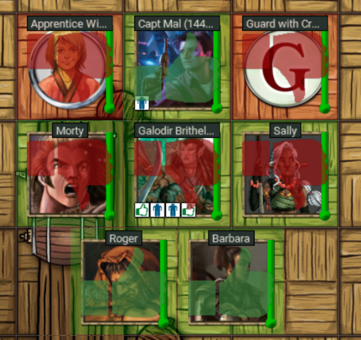

# Matjam's Status Indicators

This extension is intended as a simpler replacement for the save status indicators 
from [5E Combat Enhancer by Styrmir](https://www.fantasygrounds.com/forums/showthread.php?47146-5e-Combat-Enhancer-(built-on-retired-GPL-Advanced-Kombat-extension)) and [5E Map Indicator for Death by Celestian](https://www.fantasygrounds.com/forums/showthread.php?38059-5E-Map-Indicator-for-Death)

It is not intended to fully replace 5E Combat Enhancer; but rather to just give the following features:-

* Currently displays the status of character health via blood splatter; and
  will render a skull and bones when the character is either dying or dead.
* Displays the result of a save as a thumbs up or down with a yellow thumbs
  up for half save.
* Save result clears when you step to next character in the combat tracker.
* Can be turned on/off in the options panel.

Blood splatter is attached to the character token not rendered to the map. 
I did not implement layers intentionally.

## Motivation

5E Combat Enhancer is complex, and is implemented by basically pulling in and
making custom edits to core 5e files in Fantasy Grounds. I found in practice
that this would interfere with other extensions that don't do that.

I also found the layer functionality confusing and problematic.

So, I intend to implement the features I need that I can't plug with other
extensions.

## Thanks

* Kent McCullough for guidance and for providing an excellent patter for
  hooking into functions in the Fantasy Grounds 5e and core rulesets.
* Styrmir for 5E Combat Enhancer.
* Celestian for 5E Map Indicator for Death.
* Darkslyde for forcing me to get off my ass to do this.

# License

All code is MIT licensed, as per the [LICENSE.md](LICENSE.md) in this
repository. I did not copy any code from other projects; I did however follow
some of the patterns that people implemented.

Images are either CC0 or Public Domain, as noted in the license file.

